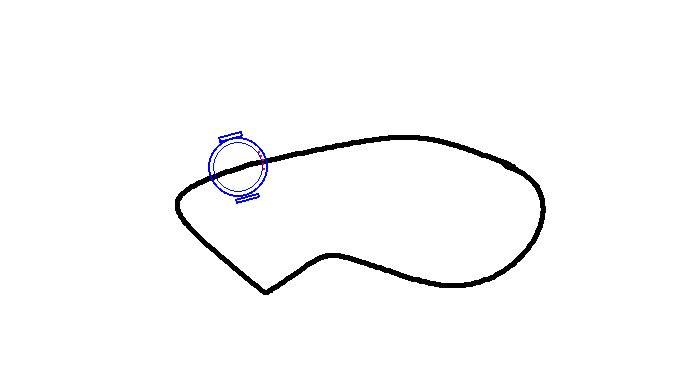

# Line Follower Simulator
This repository provide a **simulator** for a **line follower robot**.

# _Manual Control_
The user can control the robot manually using keyboard keys (arrows and space bar keys). For this, he should comment the line that invoke automatic control method ([line 161](https://github.com/SlimBenAmor/line-follower-simulator/blob/master/line_follower_simulator.py#L161)) and uncomment the line that invoke manual control method ([line 168](https://github.com/SlimBenAmor/line-follower-simulator/blob/master/line_follower_simulator.py#L168)).

# _Automatic Control_
The user can set the automatic control mode of the robot by commenting the line that invoke manual control method ([line 168](https://github.com/SlimBenAmor/line-follower-simulator/blob/master/line_follower_simulator.py#L168)) and by uncommenting the line that invoke automatic control method ([line 161](https://github.com/SlimBenAmor/line-follower-simulator/blob/master/line_follower_simulator.py#L161)).
Moreover, the user can change the default circuit and control algorithm by using new image (*e.g.* "circuit_2.png" ) for the background and the circuit to follow and by implementing his own version of "[automatic_control](https://github.com/SlimBenAmor/line-follower-simulator/blob/master/line_follower_simulator.py#L129)" method.

# _Future Work_
We plan to add background simulator mode with no graphical interface in order to allow some reinforcement learning algorithms and libraries (*e.g.* [gym](https://www.gymlibrary.ml/)) to interact with our simulator and to learn a control policy for an automatic agent.
